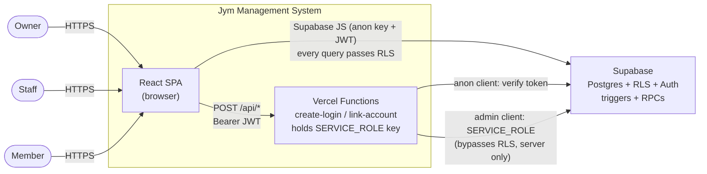
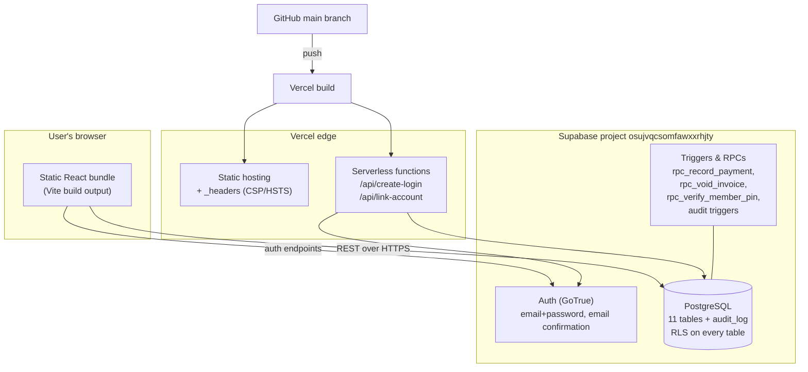
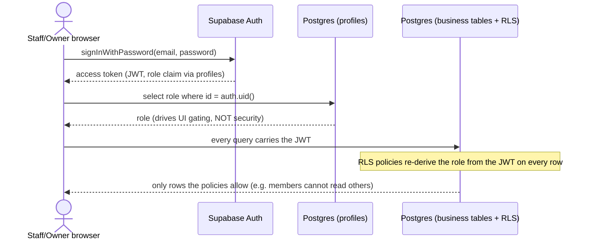
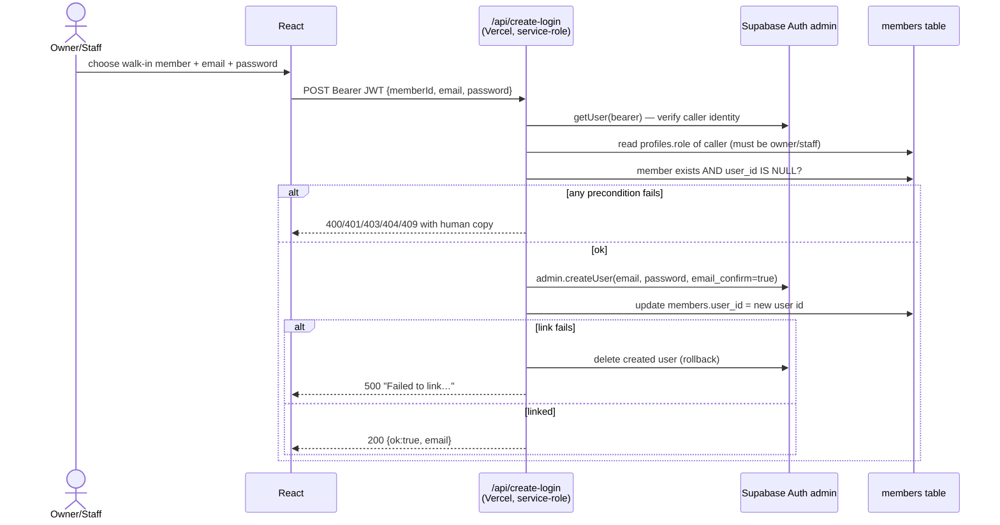

# Architecture

Jym Management System — a gym front-desk application (Philippines; PHP
currency; Asia/Manila timezone everywhere). This document is the
architecture/deployment reference: system context, runtime topology, and the
sequence diagrams for the three flows that cross trust boundaries.

## Stack

- **Web**: React 18 + TypeScript + Vite + Tailwind CSS, in `apps/web/`
- **Backend**: Supabase (PostgreSQL + Auth + Row Level Security + database
  triggers/RPCs), schema in `supabase/migrations/` (001–028)
- **Serverless**: two Vercel functions in `apps/web/api/` — the only custom
  HTTP endpoints; they hold the service-role key server-side (see
  `docs/API_CONTRACTS.md`)
- **Deploy**: Vercel, auto-deploy on push to `main` (`jym-management-system.vercel.app`)
- **CI**: GitHub Actions (`.github/workflows/ci.yml`) runs lint + unit tests +
  build on every push/PR; live-database integration tests skip without secrets

## System context (C4 level 1)



Trust boundary: everything inside the browser is untrusted. The database is
protected by RLS policies for every direct path; the two functions are the
only place where the service-role key may act above RLS.

## Deployment topology (C4 level 2)



## Key sequence diagrams

### 1. Sign-in → RLS-scoped data access



The UI hides buttons by role, but security comes exclusively from RLS — a
crafted request without permission returns zero rows or an error.

### 2. Record payment (atomic RPC transaction)

```mermaid
sequenceDiagram
  actor S as Front desk (staff)
  participant SPA as React
  participant RPC as rpc_record_payment()<br/>SECURITY DEFINER
  participant DB as Postgres tables

  S->>SPA: amount + method (+ reference)
  SPA->>RPC: call with invoice id, member id, amount, method
  Note over RPC: row-locks the invoice; verifies caller is staff/owner;<br/>verifies amount = invoice total exactly
  RPC->>DB: insert payments row (processed_by = caller)
  RPC->>DB: update invoices set status='paid', paid_at=now()
  RPC->>DB: expire prior active membership; insert new active membership<br/>(extends from previous end date when renewing early)
  RPC-->>SPA: success (single atomic transaction — no partial states)
```

Failure at any step rolls back the whole transaction: money can never be
recorded against an unpaid-or-wrong-amount invoice, and a paid invoice can
never silently gain a second membership.

### 3. Create member login (service-role boundary)



Full request/response contracts for both functions (including link-account):
`docs/API_CONTRACTS.md`.

## Structure

```
apps/web/
  api/
    create-login.ts             Serverless function (service-role boundary)
    link-account.ts             Serverless function (service-role boundary)
  src/
    main.tsx                    Entry point
    App.tsx                     Routes (auth + protected shell)
    lib/supabase.ts             Supabase client from env vars; null when unconfigured
    lib/dates.ts                Manila-timezone helpers used everywhere
    components/ui/              Design system: PageShell, Tabs, SectionCard,
                                StatusBadge, RowMenu, ConfirmModal, buttonClasses…
    features/
      auth/                     AuthContext, AuthPage, ProfilePage, reset flow
      dashboard/                Owner landing page (stats, weekly chart, renewal reminders)
      members/                  Members CRUD, logins/linking, PINs, memberships
      checkins/                 Check in (search/QR/PIN), today list, history + CSV
      classes/                  Class definitions, weekly sessions, bookings
      payments/                 Invoices, record-payment, void/undo, staff totals
      ledger/                   Member statements
      staff/                    Role management (owner-gated)
      audit/                    Read-only activity log (audit trail)
      memberAccounts/           create-login/link-account client wrappers
      membership/               Member self-service view
```

## Cross-cutting decisions

- **Repository pattern** per feature: interface + mock (unit tests + dev
  fallback behind `hasSupabaseConfig`) + Supabase implementation + component
  tests + live integration tests that skip without env vars.
- **Write-then-refresh consistency**: mutations write first, then refresh the
  affected lists; if the refresh fails the UI says so explicitly instead of
  pretending success ("…but the list may be out of date").
- **Timezone correctness**: every timestamp renders in Asia/Manila; day
  boundaries (today/week/month/grace/expiry) use Manila calendar dates via
  `lib/dates.ts`; the duplicate-check-in unique index uses an IMMUTABLE
  `manila_day()` SQL helper.
- **Error copy standard**: users see human sentences; raw errors go to
  `console.warn`; known domain messages pass through whitelists.
- **Known capacity assumptions** (deliberate scope): lists are fetched whole
  and paginated client-side — comfortable to ~200 members / a few thousand
  rows; server-side pagination is deferred (audit D5).
- **Known divergence**: the dashboard MOCK buckets days by browser-local time;
  the live implementation buckets by Manila. Demo-only, documented in HANDOFF.
