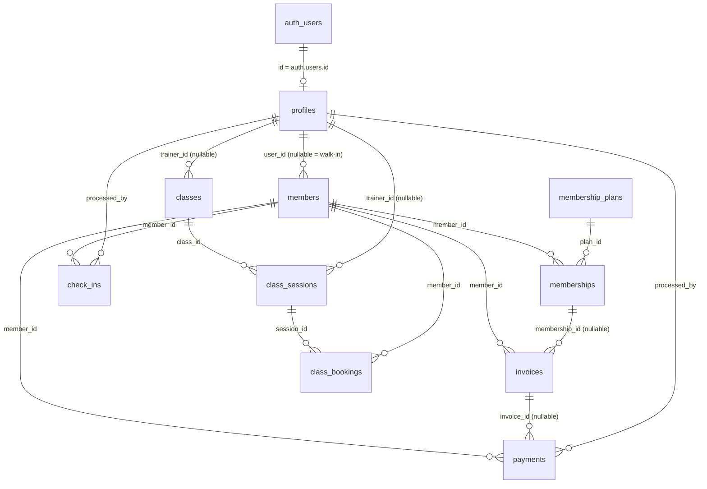

# Entity-Relationship Diagram (ERD)

Authoritative entity model for Jym Management System, as implemented in
`supabase/migrations/001_initial_schema.sql` and `005_business_schema.sql`.
Every relationship below is enforced with a foreign key in the live schema.

## Entities

| Entity | Purpose | Key columns |
|---|---|---|
| `profiles` | One row per auth user; `role` = owner / staff / member | `id` (PK, = auth.users.id), `role` |
| `members` | Gym members; `user_id` NULL = walk-in without an account | `id`, `user_id` (unique where not null), `full_name`, `is_active` |
| `membership_plans` | Recurring plan catalog (price, duration) | `id`, `name`, `price`, `duration_days`, `is_active` |
| `memberships` | History rows; the current one = latest active | `id`, `member_id`, `plan_id`, `started_at`, `ended_at`, `status` |
| `check_ins` | Attendance events | `id`, `member_id`, `checked_in_at`, `method` (manual/qr), `processed_by` |
| `classes` | Recurring weekly class definition | `id`, `name`, `capacity`, `day_of_week` (0=Mon..6=Sun), `start_time`, `end_time` |
| `class_sessions` | Materialized occurrences; bookings attach here | `id`, `class_id`, `scheduled_at`, `capacity`, `status` |
| `class_bookings` | One row per member per session | `id`, `session_id`, `member_id`, `status`, UNIQUE (session_id, member_id) |
| `invoices` | Record-only billing documents | `id`, `invoice_number` (unique), `member_id`, `total`, `status` |
| `payments` | Record-only payment entries, audit trail | `id`, `invoice_id`, `member_id`, `amount`, `method`, `processed_by` |

## Design decisions (verified in schema)

1. **Walk-in members** — `members.user_id` is nullable, so walk-ins need no account; member-only RLS paths key off `members.user_id`.
2. **Membership history** — `memberships` stores rows, not a single "current plan" column; the current membership is the latest `status = 'active'` row. `memberships` cannot be deleted (RLS `delete_none`).
3. **Materialized sessions** — `class_sessions` rows are created explicitly (UI: "Schedule this week"); bookings never reference the recurring `classes` row directly, so a class can be edited without corrupting existing bookings.
4. **Invoice/payment split** — `invoices` (document, status lifecycle issued → paid/void; owner can undo a paid invoice back to issued) and `payments` (money entry with `processed_by` audit). Recording a payment flips the invoice to paid (client-side two-step in `supabasePaymentRepository.ts`).
5. **Cascade rules** — `members` delete → cascades `check_ins`, `memberships`, `class_bookings`; `classes` delete → cascades `class_sessions` → `class_bookings`. `invoices`/`payments`/`memberships` use RESTRICT or `delete_none` — financial records are never removed.
6. **Audit trail** — `check_ins.processed_by` and `payments.processed_by` reference `profiles.id` (who recorded the event; NULL for seeds/legacy rows).